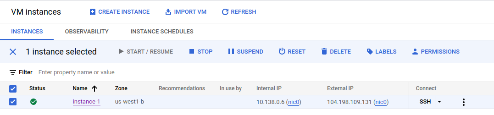

## How-to Guide
### 1. Install prerequisites
```shell
pip install -r requirements.txt
```

### 2. Create your secret file
After creating, please replace mine at `secrets/mle-course-00d1417f42ca.json`


### 3. Run a simple playbook
This playbook simply provisions a compute engine
```shell
cd simple_playbook
ansible-playbook simple_playbook.yml
```

**Note:** Update `state: absent` to destroy the instance

### 4. Run some more complicated playbooks
#### 4.1. Provision the server and firewall rule
    ```shell
    cd playbook_with_docker
    ansible-playbook create_compute_instance.yaml
    ```

#### 4.2. Install Docker and run the application
After your instance has been started as the folowing image, get the External IP (e.g., `104.198.109.131` as in the example) and replace it in the inventory file


, and run the following commands:
    
    ```shell
    cd playbook_with_docker
    ansible-playbook -i ../inventory install_and_run_docker.yml
    ```
, now, you should be able to access your application via `http://104.198.109.131:30000/docs`